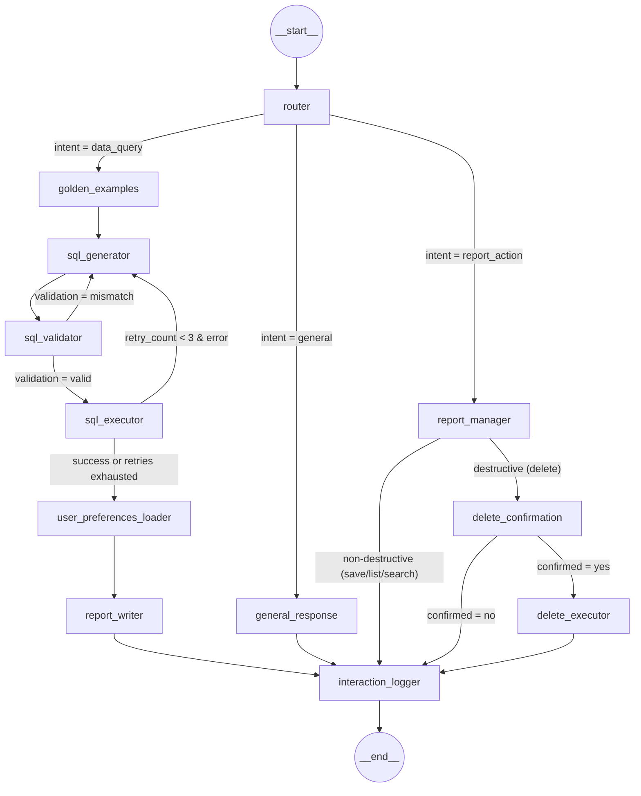

```mermaid
graph TD
    START((__start__))
    router[router]
    golden_examples[golden_examples]
    sql_generator[sql_generator]
    sql_validator[sql_validator]
    sql_executor[sql_executor]
    user_preferences_loader[user_preferences_loader]
    report_writer[report_writer]
    general_response[general_response]
    report_manager[report_manager]
    delete_confirmation[delete_confirmation]
    delete_executor[delete_executor]
    interaction_logger[interaction_logger]
    END((__end__))

    START --> router

    router -- "intent = data_query" --> golden_examples
    router -- "intent = general" --> general_response
    router -- "intent = report_action" --> report_manager

    golden_examples --> sql_generator
    sql_generator --> sql_validator

    sql_validator -- "validation = valid" --> sql_executor
    sql_validator -- "validation = mismatch" --> sql_generator

    sql_executor -- "retry_count < 3 & error" --> sql_generator
    sql_executor -- "success or retries exhausted" --> user_preferences_loader

    user_preferences_loader --> report_writer
    report_writer --> interaction_logger

    general_response --> interaction_logger

    report_manager -- "non-destructive (save/list/search)" --> interaction_logger
    report_manager -- "destructive (delete)" --> delete_confirmation

    delete_confirmation -- "confirmed = yes" --> delete_executor
    delete_confirmation -- "confirmed = no" --> interaction_logger

    delete_executor --> interaction_logger

    interaction_logger --> END
```
